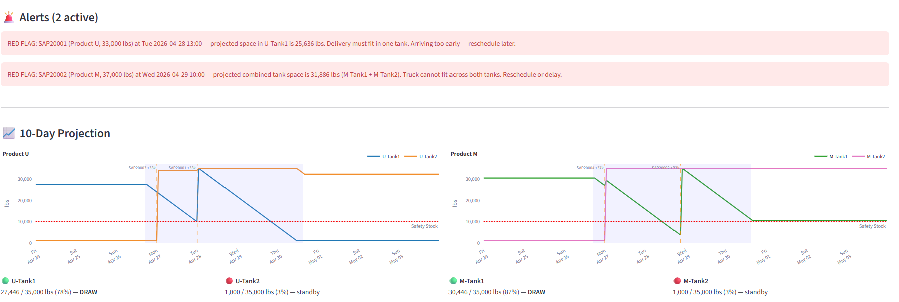

# VMI Automation

> Autonomous tank monitoring, schedule parsing, and order placement for vendor-managed inventory.



## Why it matters

The supply chain team spends significant time every week managing one specific customer with a poor VMI profile: late Friday schedule emails, week-to-week volatility, frequent unplanned downtime, relatively small tanks, and shelf-life limits. This account has already absorbed real cost from returned trucks that wouldn't fit and aged-material returns — and real risk from multiple near run-outs.

This prototype demonstrates how an AI-driven VMI tool would handle that workload end-to-end.

## What it does

- Ingests live tank telemetry every hour
- Parses schedule emails with an LLM (handles any natural-language format)
- Projects 7-day levels and auto-places EDI orders
- Fires live alerts before problems happen
- Scales reorder targets dynamically with projected weekly run hours

## Workflow

1. Hourly telemetry update triggers a fresh projection
2. Microsoft Graph checks the inbox for new schedules
3. LLM parses the schedule email into run windows
4. Planner projects demand against dynamic targets
5. Load-entry PDF built and order placed via EDI

## Live alerts

| Severity | Alert |
|---|---|
| 🔴 | Safety-stock breach projected |
| 🔴 | Overfill on arriving truck |
| 🔴 | Plant running off-schedule (3+ hrs) |
| 🟡 | Lead-time shortfall |
| 🟡 | Low-confidence schedule parse |
| 🟡 | No schedule received by Fri 3 PM |
| 🟡 | Late truck (3+ hrs overdue) |

## Dynamic target levels

Reorder targets scale with projected weekly run hours. Light weeks (≤ 28 run hrs) target **15,000 lbs**; heavy weeks (≥ 118 run hrs) target **27,000 lbs**; intermediate weeks interpolate linearly. This reduces shelf-life exposure in slow weeks and run-out risk when the plant ramps up.

## Tech & integration stack

- **Python + Streamlit** — core platform and UI
- **LLM** — schedule-email parsing
- **Microsoft Graph API** — inbox automation (production) / IMAP (prototype)
- **SAP + EDI** — order verification and placement
- **ReportLab** — load-entry and product-sheet PDF generation
- **Plotly** — tank-level projection charts

## Run locally

```bash
git clone https://github.com/JD8-rgb/vmi-prototype.git
cd vmi-prototype
python -m venv venv
venv\Scripts\activate          # Windows
# or: source venv/bin/activate  # macOS/Linux
pip install -r requirements.txt
streamlit run app.py
```

For LLM schedule parsing, add an Anthropic API key to `.streamlit/secrets.toml`:

```toml
ANTHROPIC_API_KEY = "sk-ant-..."
```

(File is gitignored; never commit real keys.)

## Product sheet

[One-page PDF](assets/product_sheet.pdf) — describes the production version of the tool, not the simulation.

## Prototype vs. production

This repo is the **simulation layer**: an advanceable clock drives hourly consumption, emails flow over IMAP, and SAP/EDI integrations are stubbed. The core logic — projection, alerts, planner, LLM schedule parsing, dynamic targets — is real and production-ready. The product sheet describes the production integration layer that wraps it.

## License

MIT — see [LICENSE](LICENSE).
