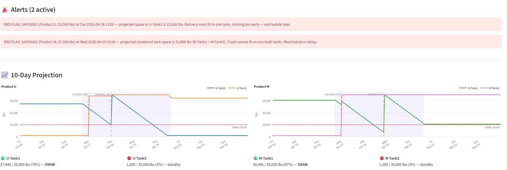

# VMI Automation

> Autonomous tank monitoring, schedule parsing, and order placement for vendor-managed inventory.



## Why it matters

The supply chain team spends significant time every week managing one specific customer with a poor VMI profile: late Friday schedule emails, week-to-week volatility, frequent unplanned downtime, relatively small tanks, and shelf-life limits. This account has already absorbed real cost from returned trucks that wouldn't fit and aged-material returns — and real risk from multiple near run-outs.

This prototype demonstrates how an AI-driven VMI tool would handle that workload end-to-end.

## What it does

- Simulates hourly tank consumption against an advanceable sim clock
- Parses schedule emails with a regex-first parser plus optional LLM rescue (common formats supported; safe-fail on anything ambiguous)
- Projects 10-day tank levels and recommends truck orders
- Fires live alerts before problems happen
- Scales reorder targets dynamically with scheduled weekly run hours

## Workflow

1. Sim-clock advance triggers a fresh projection
2. IMAP checks the inbox for new schedules (Microsoft Graph in production)
3. Parser converts the schedule email into run windows
4. Planner projects demand against dynamic targets
5. Load-entry PDF built; demo emits a simulated SAP order number (real SAP/EDI integration is production scope)

## Live alerts

| Severity | Alert |
|---|---|
| 🔴 | Safety-stock breach projected |
| 🔴 | Overfill on arriving truck |
| 🔴 | Plant running off-schedule (3+ hrs) |
| 🟡 | Lead-time shortfall |
| 🟡 | Low-confidence schedule parse |
| 🟡 | No schedule received by Fri 3 PM |
| 🟡 | Late truck (3+ hrs overdue) |
| 🟡 | Schedule applied via LLM parse (operator verify recommended) |

## Dynamic target levels

Reorder targets scale with scheduled weekly run hours. Light weeks (≤ 28 run hrs) target **15,000 lbs**; heavy weeks (≥ 118 run hrs) target **27,000 lbs**; intermediate weeks interpolate linearly. This reduces shelf-life exposure in slow weeks and run-out risk when the plant ramps up.

## Tech & integration stack

- **Python + Streamlit** — core platform and UI
- **LLM** — schedule-email parsing
- **Microsoft Graph API** — inbox automation (production) / IMAP (prototype)
- **SAP + EDI** — order verification and placement
- **ReportLab** — load-entry and product-sheet PDF generation
- **Plotly** — tank-level projection charts

## Run locally

```bash
git clone https://github.com/JD8-rgb/vmi-prototype.git
cd vmi-prototype
python -m venv venv
venv\Scripts\activate          # Windows
# or: source venv/bin/activate  # macOS/Linux
pip install -r requirements.txt
streamlit run app.py
```

For LLM schedule parsing, add an Anthropic API key to `.streamlit/secrets.toml`:

```toml
ANTHROPIC_API_KEY = "sk-ant-..."
```

(File is gitignored; never commit real keys.)

## Product sheet

[One-page PDF](assets/product_sheet.pdf) — describes the production version of the tool, not the simulation.

## Prototype vs. production

This repo is the **simulation + decision-support layer**. An advanceable clock drives hourly consumption, emails flow over IMAP/SMTP, schedule parsing runs locally (regex-first plus optional LLM rescue), and SAP order numbers are assigned in-process. State lives in `data.json` and per-session Streamlit memory.

The **production targets** described in the product sheet — Microsoft Graph for email, durable database with audit log, SAP order validation + EDI 855/856 acknowledgement loop, RBAC, secrets manager, monitoring — are not in this repo. Treat the parser, planner, alerting, and projection logic as *promising core algorithms with a working demo wrapper*, not as production-ready integration code.

## License

MIT — see [LICENSE](LICENSE).
